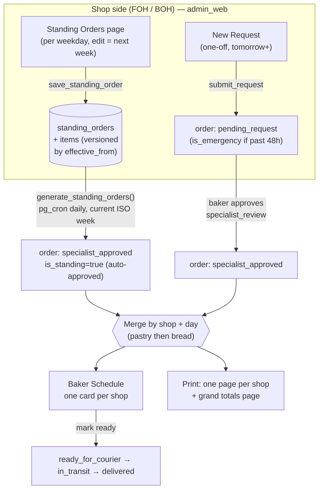

# Standing Orders (Phase 1 — backend + admin_web)

A **standing order** is a recurring weekly order a shop gets automatically. The shop
defines it once per weekday; a nightly job materialises it into a real, **auto-approved**
order so the baker always receives it without anyone re-ordering or approving. One-off
**New Requests** still need baker approval and become *emergency* orders past the 48h
cut-off. The baker works/prints everything **merged per shop per day**.

Scope: pastry (FOH) + bread (BOH) get per-weekday standing orders. **Meat is not a
standing order in v1** — BOH orders meat ad-hoc via New Request (the schema does not block
adding meat standing orders later). Shipped on web (admin_web) **and** both Flutter apps
(shop_app / hub_app).

## Pipeline

## Data model (migrations 0044–0048)

- `standing_orders (shop_id, owner_role, weekday 1-7 ISO, effective_from, is_active, created_by)`
  — `standing_order_items`, `standing_order_item_modifiers` mirror `order_template*`.
- `orders.is_standing` + `orders.standing_order_id` tag generated rows (audit + idempotency).
- `save_standing_order(p_weekday, p_effective_from, p_items)` — SECURITY DEFINER, derives
  shop/role from `auth.uid()`, enforces the FOH→pastry / BOH→bread+meat category guard.
- `generate_standing_orders()` — service_role; for each date in the current ISO week, picks
  the latest version effective on/before that date and inserts auto-approved orders, split
  per category, idempotently. Scheduled via pg_cron (see `CRONS.md`).

## "Edits take effect next week"

Each edit inserts a **new version** with `effective_from = next Monday`; creation is
effective immediately. The generator only materialises the **current ISO week**, so a
this-week edit (effective next Monday) can never disturb an already-generated day — no
regeneration logic. The Standing Orders page shows the current-week version (read-only) and
a "changes pending for next week" badge when a future version exists.

## Baker view & printing

- **Schedule** (`/board`): day tabs; within a day, one card per shop merging standing
  orders + approved New Requests, summed per product, grouped pastry → bread.
- **Print** (`/print`): one A4 page per shop (merged, pastry → bread), then a final
  **production-totals** page summing each item across all shops. Specialist scope shows only
  their category; courier scope shows all. New Requests are merged into totals, never listed
  separately.

## Mobile (Flutter)

- **shop_app**: the Templates screen is replaced by **Standing Orders** (`/standing-orders`,
  weekday cards, edit-for-next-week, pending badge, lock note). New Request gains a
  "Save as standing order" action (weekday picker → next week). Editor reuses `catalogProvider`.
- **hub_app**: **Schedule** gains per-day chips (Today / Tomorrow / weekday), merges each
  shop's standing + approved requests into one card ordered pastry → bread, and prints one page
  per shop + a totals page (`print_sheet.dart` gained `perShopPages` + `totals`). **Route**
  (courier) prints the same per-shop + totals layout. `PendingItem` / `RouteItem` carry the
  product category for ordering. No new codegen — plain classes + raw maps, matching the
  existing screens.
